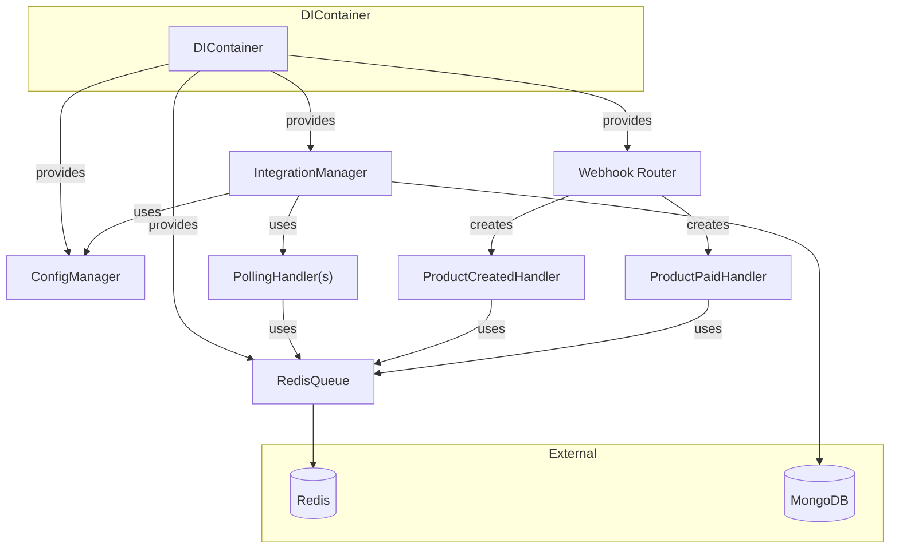

# Lexamica Integration System

## Overview

This project is a scalable, configurable bi-directional synchronization system between two services using Node.js, MongoDB, and Redis (TypeScript). It features modular integration logic, robust error handling, and a clean architecture for maintainability and extensibility.

Before running the project, make sure you have the following installed:

- [Docker](https://www.docker.com/get-started)
- [Docker Compose](https://docs.docker.com/compose/install/)

You will also need to copy the example environment file and review the variables:

```sh
cp .env.example .env
```

Edit the `.env` file in the root folder to update any values as needed for your environment (e.g., database URLs, ports, endpoints).

## Deployment with Docker Compose

You can deploy the entire system (app, MongoDB, Redis, and mock third-party service) using Docker Compose. This is the recommended way to run the project in a consistent environment.

### Steps

1. **Build and start all services:**
   ```sh
   docker-compose up --build
   ```
   This will build the app and mock-third-party images and start all services defined in `docker-compose.yml`.

2. **Access the app:**
   - The main app will be available at [http://localhost:3000](http://localhost:3000)
   - The mock third-party service will be available at [http://localhost:4000](http://localhost:4000)
   - MongoDB will be running on port 27017, and Redis on port 6379 (for internal use)

3. **Stopping the services:**
   Press `Ctrl+C` in the terminal running Docker Compose, or run:
   ```sh
   docker-compose down
   ```

### Notes
- Make sure Docker and Docker Compose are installed on your system.
- You can customize environment variables in the `.env` file.
- Data for MongoDB and Redis is persisted in Docker volumes (`mongo_data`, `redis_data`).

## API Testing with Insomnia

You can import the included [Insomnia collection](./docs/insomnia_collection.yaml) to quickly test all API endpoints.

**How to use:**
1. Download or clone this repository.
2. Open Insomnia.
3. Go to `Import/Export` > `Import Data` > `From File`.
4. Select `insomnia_collection.json`.

## Testing

This project uses [Jest](https://jestjs.io/) for automated testing.

**How to run all tests:**

```sh
npm run test
```

This will run all test suites and display the results in your terminal.

- Make sure you have installed all dependencies with `npm install` before running tests.
- By default, Jest will look for files with `.test.ts` in the `src` directory.

You can also run Jest in watch mode for development:

```sh
npx jest --watch
```

---

## Architecture Overview



- **DIContainer**: Central place for creating and providing shared dependencies.
- **RedisQueue**: Handles all Redis queue operations.
- **ConfigManager**: Loads and manages integration configs.
- **IntegrationManager**: Orchestrates integration logic, creates PollingHandlers.
- **PollingHandler**: Periodically fetches data and enqueues to Redis.
- **Webhook Router/Handlers**: Handle incoming webhooks and enqueue events.

## Dependency Injection (DI)

The project uses a simple Dependency Injection (DI) pattern via a `DIContainer` class. This approach centralizes the creation and management of shared dependencies, making the codebase more modular, testable, and easier to extend.

### Why Dependency Injection?
- **Centralizes dependency creation:** All shared services (like Redis, configuration, etc.) are created in one place.
- **Decouples components:** Business logic does not directly instantiate or import dependencies, making it easier to swap implementations (e.g., for testing).
- **Scales well:** As the project grows, new dependencies can be added to the container without cluttering the main entrypoint.

### How It Works
- The `DIContainer` class instantiates and exposes singletons for:
  - `RedisQueue`: Handles all Redis queue operations.
  - `ConfigManager`: Manages configuration for integrations.
  - `IntegrationManager`: Orchestrates integration logic, using the above dependencies.
- Components that need these dependencies receive them via constructor parameters, not by importing or instantiating them directly.

### How DI is Used
- In `src/index.ts`, the DI container is created:
  ```ts
  import { DIContainer } from './integration/DIContainer';
  const diContainer = new DIContainer();
  ```
- The shared `RedisQueue` instance is injected into the webhook router and integration manager:
  ```ts
  app.use('/webhook', require('./integration/webhooks').default(diContainer.redisQueue));
  // IntegrationManager is also created inside the DIContainer
  ```
- All business logic that needs Redis access receives the same `RedisQueue` instance, managed by the container.

## Extending the DIContainer

To add a new shared dependency:
1. Instantiate it in the `DIContainer` constructor.
2. Add a getter for it.
3. Pass it to any components that need it.

**Example:**
```ts
export class DIContainer {
  private _myService: MyService;
  constructor() {
    this._myService = new MyService();
  }
  get myService() {
    return this._myService;
  }
}
```

Notes: For testing, you can create a DIContainer that provides mock or stub dependencies, making it easy to isolate and test components.

**Questions?**
Feel free to open an issue or ask for help with extending or testing the DI setup!

## Work in Progress

### Two-Way Sync Rule

A planned feature is to support two-way synchronization between systems. The intended flow is as follows:

- When an event or data change occurs (e.g., via an API call to this system), the system will process the update.
- After processing, the system will trigger a webhook call to an external API, using the `webhookEndpoint` parameter defined in the integration configuration.
- This allows external systems to be notified of changes and keep their data in sync with this system.
- The same mechanism can be used in reverse: when the external system calls this system's webhook endpoint, the data is processed and optionally propagated back.

This approach enables robust, bi-directional (two-way) synchronization between services, ensuring data consistency across platforms.

### Field Mapping Between Systems

Another planned feature is flexible field mapping between systems. The idea is to allow administrators or integrators to define how fields from our Lexamica system correspond to fields in another system. For example:

- A mapping configuration will specify that `systemA.productName` maps to `systemB.name`, or `systemA.price_cents` maps to `systemB.price` (with optional transformation logic).
- During synchronization, data will be transformed according to these mappings, ensuring compatibility and correct data flow between heterogeneous systems.
- This will support both simple renaming and more complex transformations (e.g., combining fields, changing formats, or applying business logic).

This field mapping capability will make the sync engine adaptable to a wide variety of external APIs and data models.

**Note:** Currently, our implementation is already supporting custom data transformation on the values of fields, but not on the keys themselves. However, adding support for key transformation (renaming fields) would not be hard to implement in the future.

### Additional Improvements (Easy to Implement)

- **Implement comprehensive error handling:**
  - More robust error handling throughout the system is planned. This was not implemented yet due to time constraints, but can be added easily.
- **Add logging with correlation IDs for tracing event flows:**
  - Adding correlation IDs to logs for tracing requests and event flows across services is straightforward and will improve observability. This was also omitted only due to lack of time.
